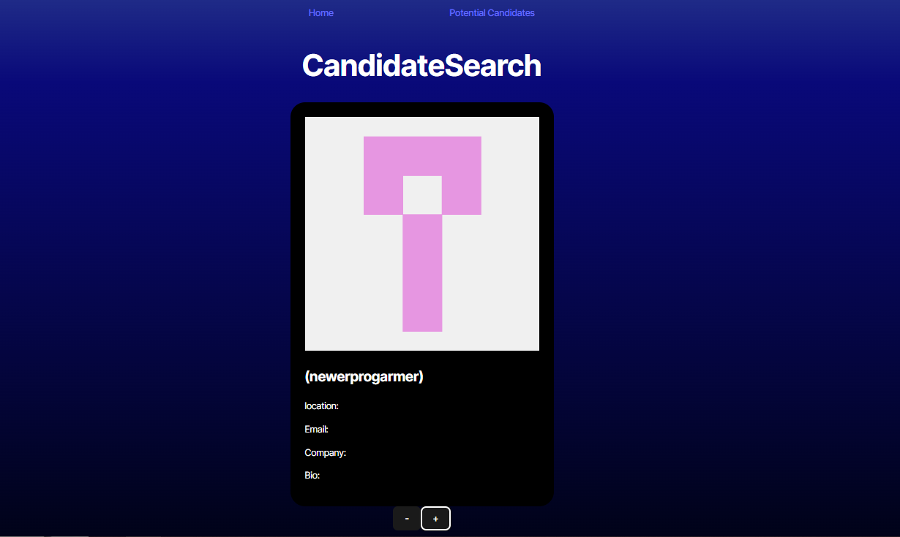
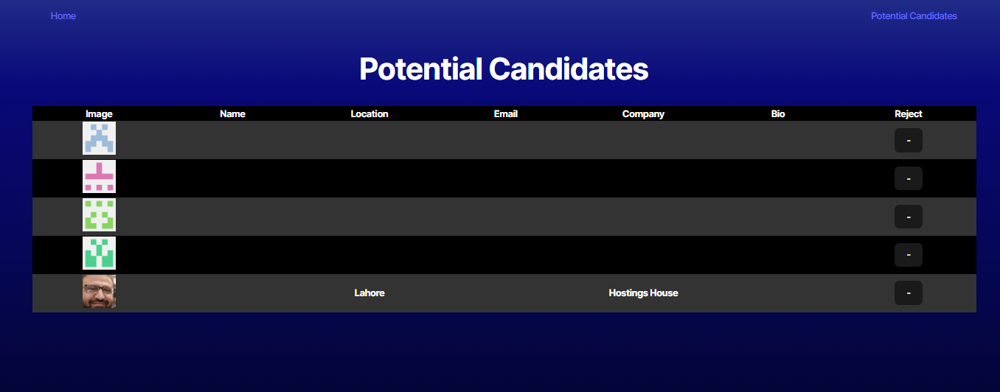

# Candidate Search

## Description

In this application, a user can create a list of potential candidates for employeement. On the home page, the user is shown a card containing the candidates GitHub information. Information that is shown is name, username, location, email, current company, and bio from their GitHub page. Below the card is two buttons to reject the candidate or accept the candidate to the list of potential candidates. On the potential candidates page, a list of saved candidates are printed to a table containing the same GitHub information as their candidate card. Candidates can be rejected from the potential employee list, removing them from the table.

## Installation

The application is deployed at the following website: https://candidatesearchapp.netlify.app/

To run the program locally, run the commands "npm i" to install dependencies and "npm run dev" to run the program as a vite application

## Usage
The navigation bar at the top of the website can move between the home page and a page listing potential candidates

 The image above is an example of the homepage. A candidate card is displayed with name, username, location, email, company and bio information taken from the candidates GitHub. Under the card, the "-" button can reject the candidate and the "+" button can put the candidate on to the potential candidates list.
 

The image abouve is an example of the potential candidates page. The webpage is a table of saved candidates taken from the home page. The table lists all the same GitHub information shown on the candidate card. At the end of the table is a "-" button which will reject the saved candidate, and remove them from the list and adjust the table to remove that candidate
 
## Credits

Vijay Natarajan (github.com/santoshalper)